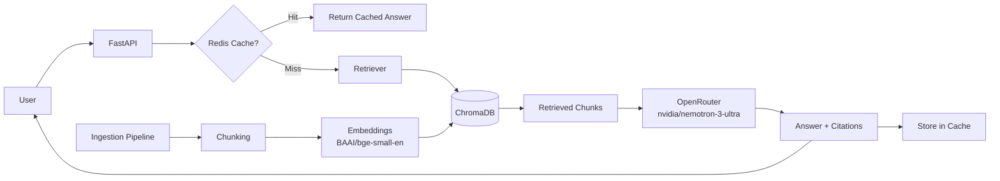

# AI Knowledge Assistant (RAG System)

## 📖 Overview
A production-ready Retrieval-Augmented Generation (RAG) system that answers questions based on internal documentation.


## 🎯 Problem Statement
Teams waste hours searching wikis, PDFs, and Slack history. This system provides instant answers with source citations.


## 🛠️ Tech Stack
- **FastAPI** – API framework
- **LangChain** – RAG orchestration
- **OpenRouter** – LLM (nvidia/nemotron-3-ultra)
- **ChromaDB** – Vector database
- **Redis** – Response caching
- **Docker** – Containerization
- **AWS S3** – Document storage# 🧠 AI Knowledge Assistant (RAG System)

[](https://www.python.org/)
[](https://fastapi.tiangolo.com/)
[](https://www.docker.com/)
[](https://www.langchain.com/)
[](https://openrouter.ai/)
[](LICENSE)

> **Production‑ready Retrieval‑Augmented Generation (RAG) system** that answers questions from internal documents with source citations.

---

## 📖 Overview

Teams spend hours searching wikis, PDFs, and Slack history for answers. This system provides **instant, accurate responses** with **verifiable source citations** by combining:

- **Document ingestion** – PDF, Markdown, plain text
- **Semantic chunking & embeddings** – local `BAAI/bge-small-en-v1.5` model
- **Vector storage** – ChromaDB for fast similarity search
- **LLM generation** – OpenRouter (using `nvidia/nemotron-3-ultra`)
- **Caching** – Redis for frequently asked questions
- **Human feedback** – up/down voting for continuous improvement

---

## 🎯 Features

- ✅ **Ask questions** in natural language – get answers with sources.
- ✅ **Ingest documents** from local files or AWS S3.
- ✅ **Smart chunking** – RecursiveCharacterTextSplitter with overlap.
- ✅ **Local embeddings** – runs on CPU, no external API cost.
- ✅ **Caching** – Redis reduces latency and cost for repeated queries.
- ✅ **Feedback loop** – collect user ratings for fine‑tuning.
- ✅ **Dockerized** – one‑command deployment with Docker Compose.
- ✅ **Full API documentation** – auto‑generated Swagger UI at `/docs`.

---

## 🏗️ Architecture



---

## 🛠️ Tech Stack

| Component | Technology |
| :--- | :--- |
| **API Framework** | FastAPI |
| **RAG Orchestration** | LangChain |
| **LLM** | OpenRouter (nvidia/nemotron-3-ultra) |
| **Vector Database** | ChromaDB |
| **Embeddings** | HuggingFace `BAAI/bge-small-en-v1.5` (local) |
| **Cache** | Redis |
| **Containerization** | Docker, Docker Compose |
| **Cloud Storage** | AWS S3 (optional) |

---

## 🚀 Quick Start (Docker)

### Prerequisites
- Docker and Docker Compose installed.
- An [OpenRouter API key](https://openrouter.ai/settings/keys) (free tier available).

### 1. Clone the repository
```bash
git clone https://github.com/Edubio228/rag-knowledge-assistant.git
cd ai-knowledge-assistant
```

### 2. Set up environment variables
```bash
cp .env.example .env
```
Edit `.env` and add your OpenRouter API key.

### 3. Start the services
```bash
cd docker
docker-compose up --build
```

The API will be available at `http://localhost:8000`.

### 4. Ingest documents
Place your PDFs, `.txt`, or `.md` files in the `sample_data/` folder, then:
```bash
docker cp sample_data/ docker-app-1:/app/
docker exec -it docker-app-1 python scripts/ingest_local.py
```

### 5. Ask a question
```bash
curl -X POST http://localhost:8000/ask \
  -H "Content-Type: application/json" \
  -d '{"question": "What is the refund policy?", "top_k": 3}'
```

Or visit the interactive docs: [http://localhost:8000/docs](http://localhost:8000/docs)

---

## 📁 Project Structure

```
ai-knowledge-assistant/
├── app/
│   ├── cache/          # Redis caching helpers
│   ├── feedback/       # Feedback storage
│   ├── ingestion/      # Load, split, embed documents
│   ├── llm/            # OpenRouter client
│   ├── retrieval/      # Vector DB and retrieval logic
│   ├── config.py       # Environment configuration
│   ├── main.py         # FastAPI entry point
│   └── models.py       # Pydantic models
├── docker/
│   ├── Dockerfile
│   └── docker-compose.yml
├── scripts/
│   ├── ingest.py       # S3 ingestion
│   └── ingest_local.py # Local ingestion
├── sample_data/        # Example documents (gitignored)
├── tests/              # Unit tests
├── .env.example        # Environment template
├── .gitignore
├── requirements.txt
└── README.md
```

---

## 🧪 API Endpoints

| Method | Endpoint | Description |
| :--- | :--- | :--- |
| `POST` | `/ask` | Ask a question; returns answer + citations + feedback ID |
| `POST` | `/feedback/{feedback_id}/{rating}` | Submit `up` or `down` rating for an answer |
| `GET` | `/health` | Health check |
| `GET` | `/docs` | Interactive Swagger UI |

### Example Request/Response

**Request:**
```json
POST /ask
{
  "question": "What is the refund policy?",
  "top_k": 3
}
```

**Response:**
```json
{
  "answer": "Customers may return items within 30 days of purchase. Items must be in original condition. Refunds are processed within 5-7 business days.",
  "citations": [
    {
      "source": "sample_data/policy.txt",
      "chunk": "Refund Policy: Customers may return items within 30 days of purchase..."
    }
  ],
  "feedback_id": "abc-123-def"
}
```

---

## 🔧 Local Development (Without Docker)

1. Create a virtual environment:
   ```bash
   python -m venv venv
   source venv/bin/activate  # or `venv\Scripts\activate` on Windows
   ```

2. Install dependencies:
   ```bash
   pip install -r requirements.txt
   ```

3. Start Redis (e.g., with Docker):
   ```bash
   docker run -d -p 6379:6379 redis:alpine
   ```

4. Run the server:
   ```bash
   uvicorn app.main:app --reload --host 0.0.0.0 --port 8000
   ```

---

## 🧠 How It Works (Under the Hood)

1. **Document Ingestion**
   - Files are loaded via LangChain loaders (PDF, Markdown, TXT).
   - Split into overlapping chunks (`RecursiveCharacterTextSplitter`).
   - Each chunk is embedded using `BAAI/bge-small-en-v1.5` and stored in ChromaDB.

2. **Question Answering**
   - User sends a question.
   - System checks Redis cache – if found, returns instantly.
   - If not, it retrieves the top‑k relevant chunks from ChromaDB.
   - Constructs a prompt with the context and asks OpenRouter (`nvidia/nemotron-3-ultra`).
   - Returns the answer with citations and a unique feedback ID.
   - Stores the result in Redis for future identical questions.

3. **Feedback Loop**
   - Users can upvote/downvote answers.
   - Feedback is logged (to JSON file or database) for future model fine‑tuning or re‑ranking.

---

## 📦 Deployment (Free Options)

- **Render** – [Render.com](https://render.com) – deploy Docker containers for free with no credit card.
- **Fly.io** – [Fly.io](https://fly.io) – 3 free VMs and global deployment.
- **Oracle Cloud** – Always‑free tier includes 4 ARM/AMD instances.

---

## 🚧 Future Improvements

- [ ] Web UI (Streamlit / React)
- [ ] Support for DOCX, HTML, CSV
- [ ] User authentication & session management
- [ ] Fine‑tune LLM with feedback data
- [ ] Advanced chunking strategies (semantic, document‑aware)
- [ ] Production monitoring (Prometheus + Grafana)
- [ ] CI/CD pipeline (GitHub Actions)

---

## 🤝 Contributing

Pull requests are welcome! For major changes, please open an issue first to discuss what you would like to change.

---

## 📄 License

Distributed under the MIT License. See `LICENSE` for more information.

---

## 📬 Contact

Email: edubioemm@gmail.com

Project Link: https://github.com/Edubio228/rag-knowledge-assistant
https://rag-knowledge-assistant-yi6h.onrender.com/

---

**⭐ If this project helped you, give it a star!**

## 🚀 Quick Start
```bash
git clone https://github.com/Edubio228/rag-knowledge-assistant.git
cd ai-knowledge-assistant/docker
docker-compose up --build
curl http://localhost:8000/health